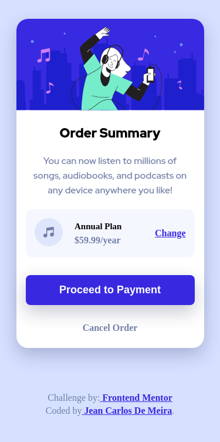
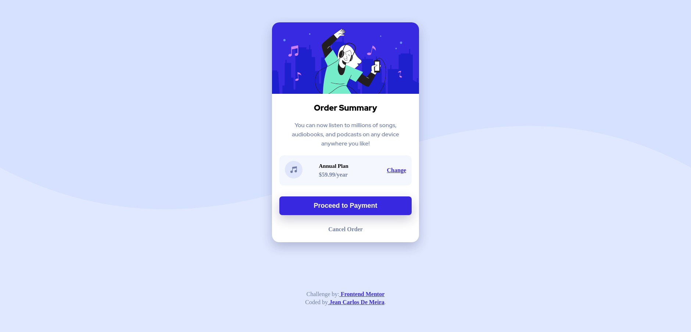

# Frontend Mentor - Order summary card solution

This is a solution to the [Order summary card challenge on Frontend Mentor](https://www.frontendmentor.io/challenges/order-summary-component-QlPmajDUj). Frontend Mentor challenges help you improve your coding skills by building realistic projects.

## Table of contents

- [Overview](#overview)
  - [The challenge](#the-challenge)
  - [Screenshot](#screenshot)
  - [Links](#links)
- [My process](#my-process)
  - [Built with](#built-with)
  - [What I learned](#what-i-learned)
  - [Useful resources](#useful-resources)
- [Author](#author)

## Overview

This is the front-end mentor's first challenge. The challenge is to build this component of the order summary card and make it as close to the design as possible. Building the desing with whatever you want to finish, any language, framework or tools.

### The challenge

Users should be able to:

- See hover states for interactive elements

### Screenshot

<p  align="center"></img></p>
<p  align="center"></img></p>

### Links

- Solution URL: [jcdmeira-order-summary](https://www.frontendmentor.io/solutions/jcdmeiraordersummary-Wd-71ZC58https://your-solution-url.com)
- Live Site URL: [jcdmeira-order-summary](https://jcdmeira-order-summary.netlify.app/)

## My process

### Built with

- Mobile-first workflow
- [React](https://reactjs.org/) - JS library

### What I learned

You can install react with

```bash
   # install project in same folder:

   npx create-react-app .

   # create a project folder named "project":

   npx create-react-app project
```

```jsx
// Use the app functional component to insert your components:

function App() {
  return (
    <div className="App">
      <Card />
      <Footer />
    </div>
  );
}

// Card and Footer are created components
```

```CSS
  /*
    Use background-image to set an image as a background
  */
  .App{
    background-image: url(./assets/images/pattern-background-mobile.svg);
  }

  /*
    with @media it is possible to set rules for certain screen sizes only, adhering to responsiveness
  */
  @media (min-width: 629px) {
  .App {
    background-size: contain;
    background-repeat: no-repeat;
    background-image: url(./assets/images/pattern-background-desktop.svg);
    background-color: hsl(225, 100%, 94%);
  }
}
```

With ReactJS parts of the code are used as components, and these are separated into a component folder, which can be reused.
As per the code below.
It is still necessary to note the pre-import of the SVG image named hero, so that the img tag does not have an error.

```jsx
import React from 'react';
import './card.css';
import hero from '../../assets/images/illustration-hero.svg';
import { Title } from '../Title';
import { Plan } from '../Plan';

function Card() {
  return (
    <div className="card">
      
      <div>
        <Title>Order Summary</Title>
        <p className="paragrafo">
          You can now listen to millions of songs, audiobooks, and podcasts on
          any device anywhere you like!
        </p>
      </div>
      <Plan value="59.99" tittlePlan="Annual Plan" linkPlan="Change" />
      <div className="paymentSystem">
        <button className="payment">Proceed to Payment</button>
        <p className="cancel">Cancel Order</p>
      </div>
    </div>
  );
}

export { Card };
```

### Useful resources

- [react tutorial](https://pt-br.reactjs.org/tutorial/tutorial.html) - This helped me structure the components and build the proposed page.
- [SVG import](https://www.ti-enxame.com/pt/javascript/como-importar-imagem-.svg-.png-em-um-componente-react/832598453/) - This is an amazing article that finally helped me understand how to import SVG. I would recommend it to anyone who is still learning this concept.
- [box-shadow](https://developer.mozilla.org/pt-BR/docs/Web/CSS/box-shadow) - This is an article that helped me box-shadow elements that contained this effect.

## Author

- Personal Page - [Jean Carlos De Meira](https://jcdmeira.github.io)
- Frontend Mentor - [@JCDMeira](https://www.frontendmentor.io/profile/JCDMeira)
- Instagram - [@jean.meira10](https://www.instagram.com/jean.meira10/)
- GitHub - [JCDMeira](https://github.com/JCDMeira)
